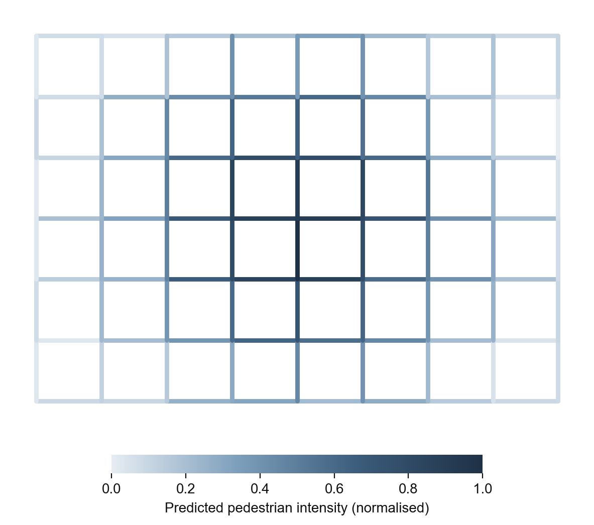
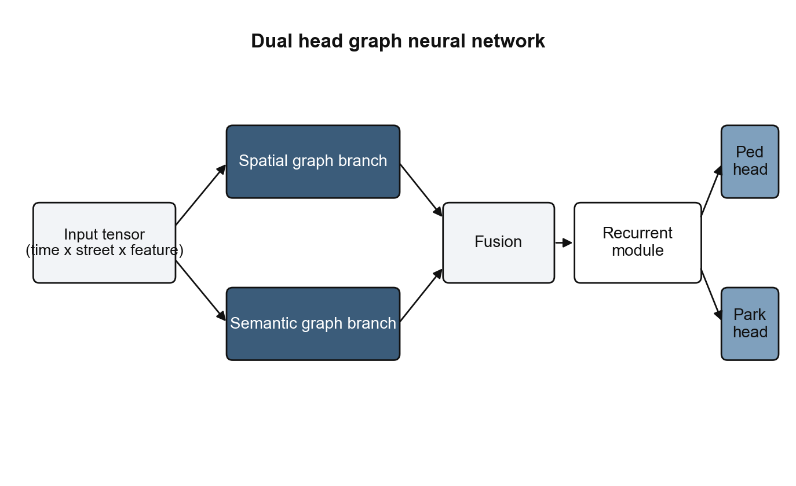
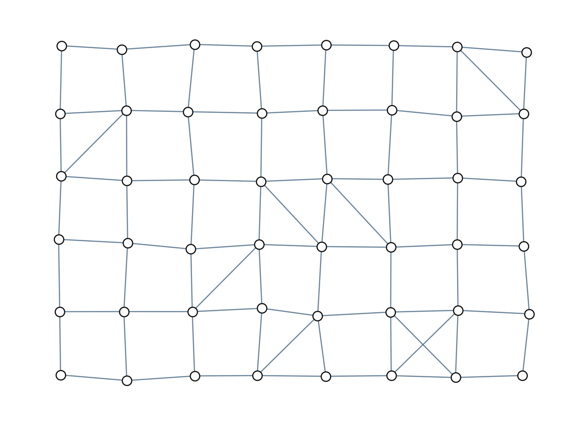
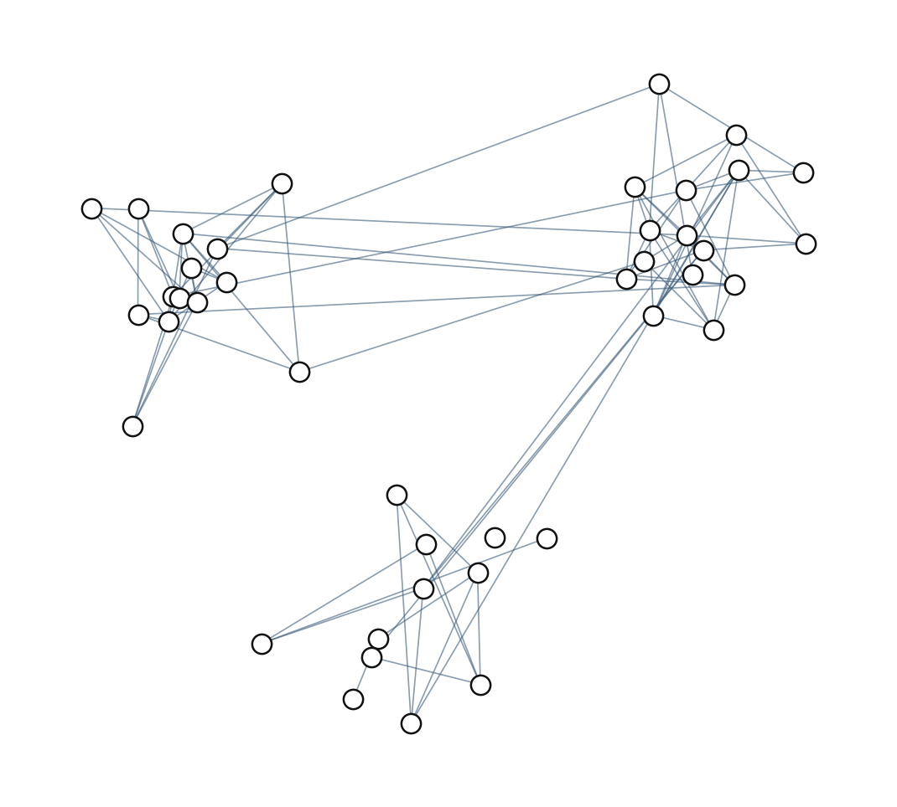
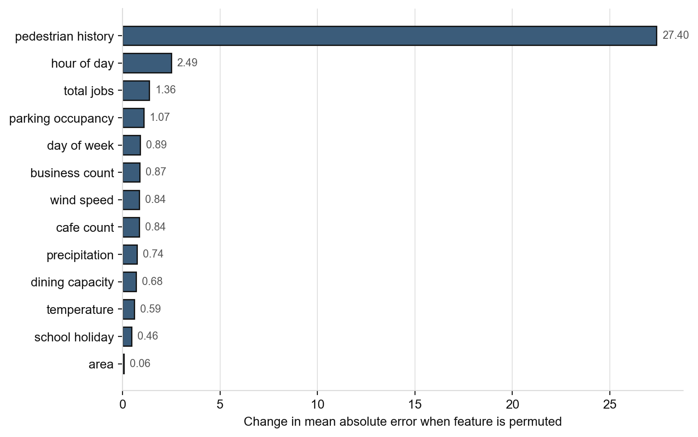

Street ID	Relationship	Mean Ped Delta	Confidence	Weighted Score
20222	Semantic Neighbour	+0.14	1.0 (Real Sensor)	+0.14
20001	Treated Street	+0.16	0.5 (Imputed)	+0.08
20121	Semantic Neighbour	+0.12	0.5 (Imputed)	+0.06
20143	Spatial Neighbour	-0.09	0.5 (Imputed)	-0.04
20138	Unknown	+0.06	0.5 (Imputed)	+0.03 

what do you mean by imputed here? imputed with whaT?
# Melbourne CBD Street Analysis Pipeline

> **Master's Thesis Project** — Spatio-Temporal Graph Neural Network for Urban Street Behaviour Modelling and Counterfactual Intervention Analysis in Melbourne CBD.

A 12-step reproducible pipeline that ingests multi-source urban data, constructs dual graph representations of Melbourne's street network, trains a spatio-temporal GNN (MultiGCN), and exposes an interactive scenario simulation tool for exploring "what-if" urban interventions — such as pedestrianising a street or reallocating kerbside parking.



---

## Motivation

Urban planners face a fundamental challenge: how do you predict the ripple effects of a street-level intervention — closing a lane to cars, adding outdoor dining, pedestrianising a block — before committing resources? Traditional traffic models struggle with the complex interplay between pedestrian activity, parking demand, land use, weather, and network topology.

This thesis addresses that gap by:

1. **Modelling the full street universe** — 3,975 CBD segments, filtered to 1,397 arterial/activity streets for the modelled graph.
2. **Fusing heterogeneous data** — pedestrian counts, parking occupancy sensors, CLUE land-use data, weather, and public holidays into a unified spatio-temporal cube.
3. **Learning joint dynamics** — a dual-head GNN simultaneously predicts pedestrian flow and parking occupancy, capturing cross-modal dependencies.
4. **Simulating counterfactuals** — autoregressive rollouts with graph diffusion estimate how interventions propagate through the network.

**Study period:** Nov 2025 – Mar 2026 (post-COVID, southern-hemisphere summer/autumn) — 14,400 time bins at 15-minute resolution.

---

## Architecture

### MultiGCN (Dual-Head Spatio-Temporal GNN)

```
Input:  [batch, W=96, N=1397, F=23]
  │
  ├─ GCNConv branch (spatial graph)  : F → H=64     ← intersection-topology + Gaussian kernel
  ├─ GCNConv branch (semantic graph) : F → H=64     ← land-use / activity similarity
  │
  └─ Concat → [batch, W, N, 128]
       │
       └─ GRU (2 layers, hidden=64, dropout=0.1)
            │
            ├─ head_ped:  Linear → [batch, N, 1]  + per-node bias  → pedestrian flow
            └─ head_park: Linear → [batch, N, 1]  + per-node bias  → parking occupancy
```

**Joint loss:** `masked_MAE_ped + 0.5 * masked_MAE_park` — the ped loss is masked to the 74 real pedestrian-sensor streets and the parking loss to the 143 real parking-sensor streets. The ~1,323 imputed streets remain in the graph as spatial context but are never prediction targets.

**Total parameters:** 68,076



### Graph Construction

| Graph | Method | Edges | Properties |
|-------|--------|-------|------------|
| **Spatial** | Intersection-topology + Gaussian kernel | 5,635 directed | 1 connected component, 0 isolates |
| **Semantic** | Land-use/activity cosine similarity | 8,097 directed | Links functionally similar streets across the CBD |

<p align="center">
  
  
</p>

### Training Results

Chronological split (no data leakage): Train 70% | Validation 15% | Test 15%

Metrics are reported on the **74 real pedestrian-sensor streets** (the evidence layer) — the honest measure. The ped loss is masked to those sensors (Exp B); imputed streets are graph context only.

| Split | Ped MAE | Ped R² | Park MAE | Park R² |
|-------|---------|--------|----------|---------|
| **Validation** | 27.85 | 0.889 | 0.058 | 0.885 |
| **Test** | 28.35 | 0.877 | 0.052 | 0.880 |

> The MAE is in raw pedestrians per 15-min bin on busy CBD arterials (peaks in the hundreds), so R² ≈ 0.88 is the headline. A prior "all-street MAE ≈ 5.8" is **not** reported — it was largely circular (the GNN scoring itself on its own imputed targets).

---

## Pipeline

The pipeline is organised into 12 sequential steps, each implemented as an independent module:

| Step | Module | Description |
|------|--------|-------------|
| 01 | `step_01_fetch.py` | Fetch raw data — parking sensors, pedestrian counters, CLUE land-use, weather |
| 02 | `step_02_snap.py` | Snap sensors to street segments, spatial aggregation of CLUE point data |
| 03 | `step_03_temporal.py` | Temporal encoding (cyclic hour/dow), weather alignment, holiday flags |
| 04 | `step_04_graph.py` | Build spatial (intersection-topology) and semantic (activity-similarity) graphs |
| 05 | `step_05_process.py` | Compute parking occupancy rates; pedestrian fill (sensored = real, unsensored = city-climatology — XGBoost removed) |
| 06 | `step_06_aggregate.py` | Aggregate street-level temporal profiles (103 features per street) |
| 07 | `step_07_cluster.py` | GMM clustering on sensored streets only (k=3, evidence-gated; imputed = `context_only`) |
| 08 | `step_08_cube.py` | Assemble the model-ready data cube `[1397, 14400, 23]` |
| 09 | `step_09_train.py` | Train MultiGCN with dual prediction heads |
| 10 | `step_10_interpret.py` | Permutation feature importance + branch contribution analysis |
| 11 | `step_11_scenario.py` | Counterfactual scenario simulation with graph diffusion and spillover |
| 12 | `step_12_export.py` | Export enriched GeoJSON and JSON for the interactive frontend |

The pipeline is **finalized**. Its methodology follows a two-layer design: a **context layer** (all 1,397 streets, so the GNN has full spatial context) and an **evidence layer** (sensored streets only, where the model is trained, clustered, and where interventions are allowed).

---

## Street Archetypes (Clustering)

Clustering runs **only on the 189 sensored streets** (ped ∪ park sensor union) — claims about street behaviour rest on observed data, not imputation. The 1,208 imputed streets are labelled `context_only`. GMM with k=3 (chosen by silhouette/stability; silhouette 0.363, ARI 0.567 — honest, weak-to-moderate structure, so archetypes are soft tendencies):

| Archetype | Count | Recommended Intervention |
|-----------|-------|--------------------------|
| Parking reallocation priority | 131 | `pedestrianise` / `restrict_park` |
| Latent morning potential | 30 | `boost_ped` |
| Major pedestrian corridor | 28 | `restrict_park` |
| _context_only_ (imputed) | 1,208 | none — graph context only |

---

## Scenario Simulation (Step 11)

Three intervention types are supported, each modifying the cube and running autoregressive rollouts through the trained model:

| Intervention | What it does | Example |
|-------------|-------------|---------|
| `pedestrianise` | Sets parking occupancy to 0 (full kerb reallocation) | Remove all parking on Flinders Lane |
| `restrict_park` | Caps parking occupancy at a given level | Allow only 30% occupancy on Swanston St |
| `boost_ped` | Adds a constant pedestrian uplift per 15-min bin | Simulate an event drawing +50 peds/bin |

Network-level analysis includes:
- **Parking spillover** — predicted via the joint parking head
- **Graph diffusion** — propagation through A^k (k=1..3 hops) on both spatial and semantic graphs
- **Rebound analysis** — half-life and recovery fraction after the intervention ends
- **Semantic neighbour reporting** — identifies functionally similar streets affected at a distance

---

## Feature Set (23 Cube Features)

| Category | Features |
|----------|----------|
| **Target signals** | `ped_flow`, `occupancy_rate` |
| **Confidence** | `ped_confidence` (1.0 = sensor, 0.5 = imputed) |
| **Temporal** | `hour_sin`, `hour_cos`, `dow_sin`, `dow_cos`, `is_weekend`, `is_public_holiday`, `is_school_holiday` |
| **Weather** | `temperature_2m`, `relative_humidity_2m`, `wind_speed_10m`, `precipitation` |
| **Land use (CLUE)** | `total_jobs`, `cafe_count`, `cafe_total_seats`, `bar_count`, `bar_patron_capacity`, `business_count`, `poi_total`, `dining_capacity`, `area_m2` |



---

## Data Sources

| Source | What | Access |
|--------|------|--------|
| [City of Melbourne — Pedestrian Counting System](https://data.melbourne.vic.gov.au) | Real-time pedestrian sensor counts | Supabase mirror |
| [City of Melbourne — On-street Parking Sensors](https://data.melbourne.vic.gov.au) | Bay-level parking events | Supabase mirror |
| [CLUE (Census of Land Use and Employment)](https://data.melbourne.vic.gov.au) | Land use, employment, hospitality, building data | Melbourne Open Data API |
| [Open-Meteo Archive API](https://open-meteo.com/) | Historical 15-min weather (temperature, humidity, wind, rain) | Public API |

---

## Interactive Frontend

The project includes a **Mapbox GL JS** interactive map with a **Chart.js** scenario panel:

- Colour-coded street segments by predicted pedestrian intensity, cluster archetype, or opportunity score
- Click any street to view its temporal profile and cluster membership
- Run counterfactual scenarios and compare baseline vs. treated time series (pedestrian flow + parking occupancy)

```bash
python api_server.py
# Open http://127.0.0.1:5050
```

**Endpoints:**

| Method | Path | Description |
|--------|------|-------------|
| `GET` | `/` | Serves the interactive map (`sensor_map_viz.html`) |
| `POST` | `/scenario` | Runs a counterfactual simulation and returns JSON results |

---

## Getting Started

### Prerequisites

- Python 3.11+
- A Supabase project with parking and pedestrian data (for Step 01)
- [PyTorch](https://pytorch.org/) with CUDA support (optional but recommended for training)

### Installation

```bash
git clone https://github.com/your-username/melbourne-ingestor.git
cd melbourne-ingestor

python -m venv .venv
source .venv/bin/activate        # Windows: .venv\Scripts\activate
pip install -r requirements.txt
```

### Configuration

Create `melbourne_pipeline/.env`:

```env
SUPABASE_URL=https://your-project.supabase.co
SUPABASE_KEY=your-service-role-key
```

All other parameters (study window, batch sizes, coordinates) are in `melbourne_pipeline/config.py`.

### Running the Pipeline

```bash
# Run all 12 steps
python melbourne_pipeline/run_pipeline.py

# Run a single step
python melbourne_pipeline/run_pipeline.py 10

# Run a range of steps
python melbourne_pipeline/run_pipeline.py 10 12
```

### Running Tests

```bash
python -m pytest tests/ -v
```

---

## Repository Structure

```
melbourne_ingestor/
├── api_server.py                      # Flask API server (scenario simulation + frontend)
├── requirements.txt
├── melbourne_pipeline/
│   ├── run_pipeline.py                # Pipeline orchestrator
│   ├── config.py                      # Central configuration
│   ├── steps/                         # step_01_fetch … step_12_export
│   ├── data/
│   │   ├── raw/                       # Fetched source data (parquet, geojson)
│   │   ├── processed/                 # Pipeline outputs (cubes, graphs, clusters)
│   │   │   └── scenario_results/      # Saved counterfactual simulation outputs
│   │   └── models/                    # Trained model weights + evaluation metrics
│   ├── frontend/
│   │   └── sensor_map_viz.html        # Interactive Mapbox GL JS map
│   └── logs/                          # Timestamped pipeline run logs
├── chatbot/                           # Conversational agent for querying pipeline results
├── scripts/                           # Utility scripts (data fetch, export, reporting)
├── tests/                             # Smoke tests and stress tests
└── docs/
    ├── figures/                       # Thesis figures (graphs, architecture, importance)
    └── notes/                         # Design decisions and issue tracking
```

---

## Key Artefacts

| Artefact | Path | Description |
|----------|------|-------------|
| Data cube | `data/processed/cube.npy` | Shape `[1397, 14400, 23]` — the model input tensor (1.85 GB) |
| Spatial graph | `data/processed/graph_spatial.pt` | Intersection-topology edges (5,635 directed) |
| Semantic graph | `data/processed/graph_semantic.pt` | Activity-similarity edges (8,097 directed) |
| Trained model | `data/models/best_model.pt` | MultiGCN state dict (dual-head, 68K params) |
| Parking mask | `data/models/parking_mask.pt` | Boolean tensor — 143 streets with real sensor data |
| Feature importance | `data/models/feature_importance.json` | Permutation importance (23 features) + branch deltas |
| Evaluation metrics | `data/models/model_eval.json` | Full val/test MAE, R², and training history |
| Frontend GeoJSON | `data/processed/streets_viz.geojson` | Enriched with predictions, opportunity scores, uplift |
| Cluster report | `data/processed/cluster_report.json` | Archetype assignments, confidence, intervention types |

---

## Known Limitations

- **Imputation = coverage, not accuracy:** unsensored streets carry a city-climatology placeholder so the graph has no holes; a leave-streets-out test showed the GNN reconstructs flow as well from this trivial fill as from a learned imputer. Their pedestrian value is **context, never a claim** — which is why clustering and interventions are restricted to sensored streets.
- **Sensor coverage:** only 74 of 1,397 streets have pedestrian sensors and 143 have parking sensors; the model is validated on these (busy arterials), and predictions on the rest are context-layer extrapolations.
- **Weak cluster structure:** silhouette ≈ 0.36 — CBD street behaviour is a continuum, so archetypes are soft tendencies rather than crisp groups.
- **Autoregressive drift:** scenario rollouts beyond ~4 hours (16 steps) are indicative rather than precise due to compounding prediction error.
- **Timezone (label, not a shift):** timestamps are naive Melbourne local (AEDT) wall-clock values carrying a UTC tzinfo label. Day/time-block assignment reads the wall-clock fields directly, so temporal profiles are correctly aligned (peak ~17:00) — there is no 11-hour profile shift.

---

## Background

This project began during an internship at the **Australian Institute of Technology (AIT)**, where the initial data ingestion and pipeline architecture were developed. It has since evolved into a full master's thesis exploring spatio-temporal graph neural networks for urban planning decision support.

## License

This project is part of a master's thesis and is provided for academic and research purposes.

---

## Acknowledgements

- **City of Melbourne** for the open pedestrian counting system, parking sensor data, and CLUE datasets
- **Open-Meteo** for the free historical weather archive API
- **PyTorch Geometric** team for the graph neural network framework
