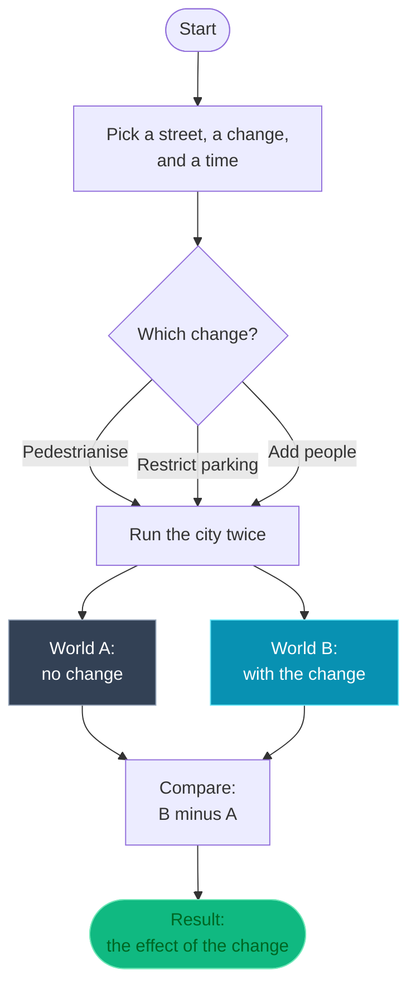

# Street "What-If" Scenario — How It Works

```mermaid
flowchart TD
    A([Start]) --> B[Pick a street, a change,<br/>and a time]
    B --> C{Which change?}
    C -->|Pedestrianise| D[Run the city twice]
    C -->|Restrict parking| D
    C -->|Add people| D
    D --> E[World A:<br/>no change]
    D --> F[World B:<br/>with the change]
    E --> G[Compare:<br/>B minus A]
    F --> G
    G --> H([Result:<br/>the effect of the change])

    classDef a fill:#334155,stroke:#94a3b8,color:#fff;
    classDef b fill:#0891b2,stroke:#67e8f9,color:#fff;
    classDef r fill:#10b981,stroke:#6ee7b7,color:#062;
    class E a;
    class F b;
    class H r;
```

**The whole idea:** run the city as it *is* and as it *would be* with the change, then the
difference between them is what the change did.
